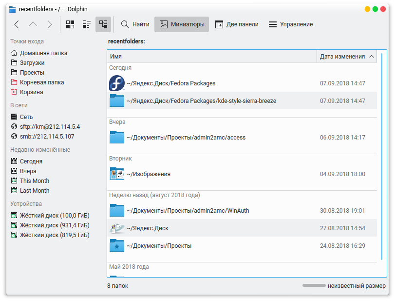

# kio_recentfolders
This is the [KIO](http://en.wikipedia.org/wiki/KIO) slave for displaying recently used folders (only folders).

This KIO slave only works when Baloo service is enabled.


## Build
```bash
mkdir build && cd build
cmake .. -DCMAKE_INSTALL_PREFIX=$(kde4-config --prefix)
make
```

## Installation
```
sudo make install
```

## Configuration
The KIO slave can be configured via configuration file.
The file will be created after first run of the KIO slave (you need to open URL ```recentfolders:/``` in Dolphin or Konqueror).

Those options can be configured:
* TimelineBackwardDays — how many days to look backward in history.

Default configuration:
```ini
[General]
TimelineBackwardDays=7
```
